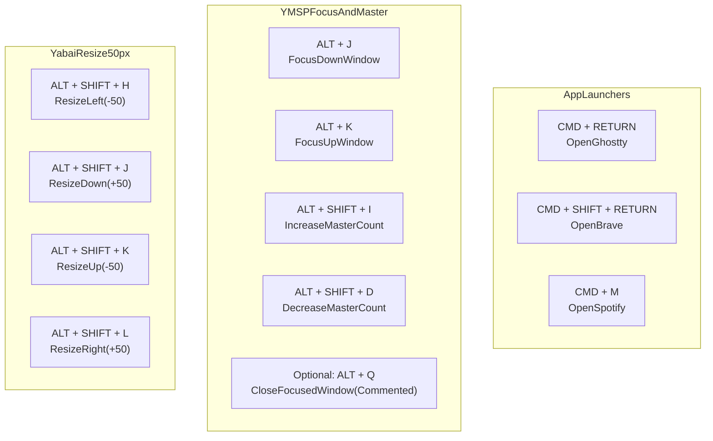

# SKHD Hotkeys Cheatsheet

> Restart after edits: `skhd --restart-service`

## Quick Reference

### App Launchers

| Hotkey | Action | Command |
| --- | --- | --- |
| <kbd>CMD</kbd> + <kbd>RETURN</kbd> | Open Ghostty terminal | `open -na /Applications/Ghostty.app` |
| <kbd>CMD</kbd> + <kbd>SHIFT</kbd> + <kbd>RETURN</kbd> | Open Brave browser | `open -na "Brave Browser"` |
| <kbd>CMD</kbd> + <kbd>M</kbd> | Open Spotify | `open -na Spotify` |

### YMSP: Focus + Master Count

| Hotkey | Action | Command |
| --- | --- | --- |
| <kbd>ALT</kbd> + <kbd>J</kbd> | Focus window down in stack | `ymsp focus-down-window` |
| <kbd>ALT</kbd> + <kbd>K</kbd> | Focus window up in stack | `ymsp focus-up-window` |
| <kbd>ALT</kbd> + <kbd>SHIFT</kbd> + <kbd>I</kbd> | Increase master window count | `ymsp increase-master-window-count` |
| <kbd>ALT</kbd> + <kbd>SHIFT</kbd> + <kbd>D</kbd> | Decrease master window count | `ymsp decrease-master-window-count` |

### Yabai: Resize Focused Window (50px)

| Hotkey | Action | Command |
| --- | --- | --- |
| <kbd>ALT</kbd> + <kbd>SHIFT</kbd> + <kbd>H</kbd> | Resize left by 50px | `yabai -m window --resize left:-50` |
| <kbd>ALT</kbd> + <kbd>SHIFT</kbd> + <kbd>J</kbd> | Resize down by 50px | `yabai -m window --resize down:50` |
| <kbd>ALT</kbd> + <kbd>SHIFT</kbd> + <kbd>K</kbd> | Resize up by 50px | `yabai -m window --resize up:-50` |
| <kbd>ALT</kbd> + <kbd>SHIFT</kbd> + <kbd>L</kbd> | Resize right by 50px | `yabai -m window --resize right:50` |

## Visual Map

## Legend And Tips

- <kbd>CMD</kbd>, <kbd>ALT</kbd>, <kbd>SHIFT</kbd> are modifier keys; <kbd>RETURN</kbd> is Enter.
- <kbd>ALT</kbd> + <kbd>J</kbd>/<kbd>K</kbd> controls YMSP focus.
- <kbd>ALT</kbd> + <kbd>SHIFT</kbd> + <kbd>J</kbd>/<kbd>K</kbd> controls Yabai resize.
- Master count changes are most visible when 3+ windows are open.
- Optional binding (commented out): <kbd>ALT</kbd> + <kbd>Q</kbd> -> `ymsp close-focused-window`.
